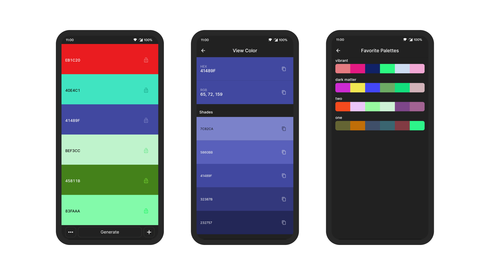

# Rainbow

Color Pallete Generator.

## :camera: Screenshots

## :book: Features

* Easy to use
* Generate Palletes
* Save Favorite Color Palletes
* Change color on the go
* more coming soon...

## :scroll: License

Licensed GPLv3+. \
Copyright © 2020–2021 yc-codes and contributors.